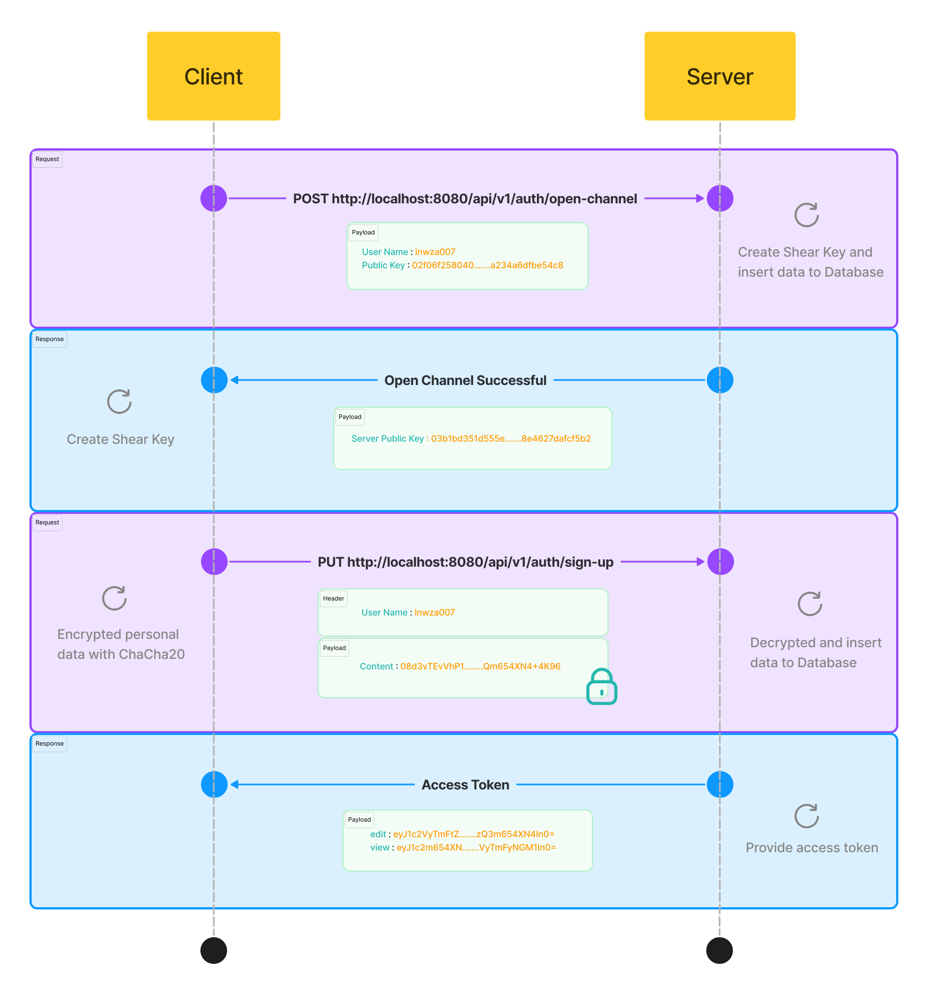
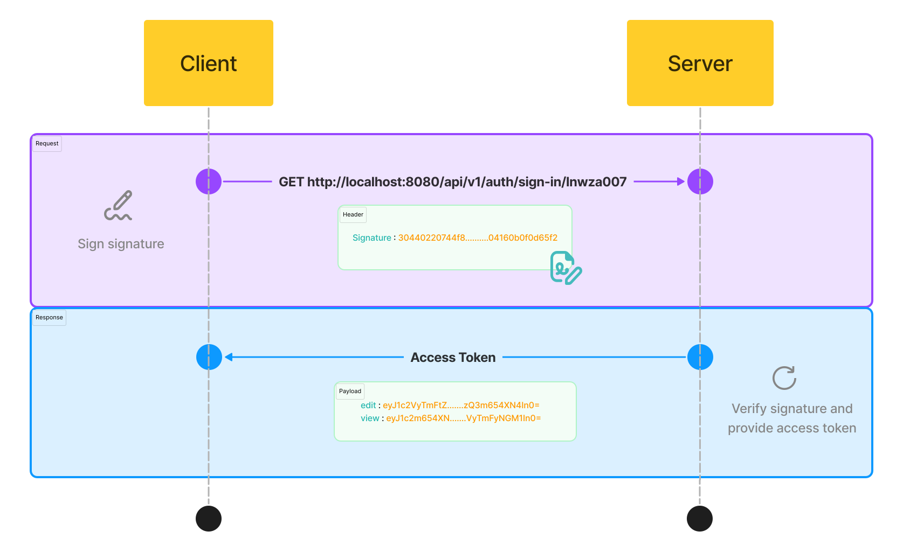

  

## Account Register 

เพื่อความปลอดภัยของข้อมูลที่ส่งไปยังเซิร์ฟเวอร์ การลงทะเบียนจำเป็นต้องมีการสร้างช่องทางสื่อสารที่ปลอดภัย โดยเฉพาะเมื่อข้อมูลที่ส่งมีความลับ เช่น ข้อมูลส่วนตัว หรือข้อความแชท ดังนั้น การใช้ Cryptography เป็นสิ่งสำคัญอย่างยิ่ง

### Elliptic Curve
ใช้ [Elliptic Curve](https://cryptobook.nakov.com/asymmetric-key-ciphers/elliptic-curve-cryptography-ecc) และเส้นโค้ง [Secp256k1](https://www.secg.org/sec2-v2.pdf) ในการสร้าง **Public Key** เป็นรูปแบบบีบอัดขนาด 33 Bytes 

> _Private Key นั้นสร้างโดยนำ Password มา Hash ด้วย Sha256 ทั้งหมด 7,200 รอบ เพื่อถ่วงเวลาพวกที่จะมา brute force_

### ECDH Share Key
ต่อไปใช้ [ECDH Key Exchange](https://cryptobook.nakov.com/asymmetric-key-ciphers/ecdh-key-exchange) เพื่อสร้าง Private Key ใหม่ โดยในกระบวนการนี้ Client และ Server จะแลกเปลี่ยน Public Key เพื่อสร้างกุญแจที่ใช้ในการเข้ารหัสข้อมูล

### ChaCha20
สุดท้ายใช้ [ChaCha20](https://cryptobook.nakov.com/symmetric-key-ciphers/chacha20-poly1305) เพื่อเข้ารหัสข้อมูล โดยใช้ Private Key ที่ได้จากขั้นตอน ECDH

  

## Log in

การเข้าสู่ระบบเพื่อเข้าใช้งานนั้น Client ต้องสร้างลายเซ็นดิจิตอล และส่งไปให้ Server เมื่อทาง Server ตรวจสอบเลยเซ็นแล้วพบว่าถูกต้อง จากนั้นจะส่ง Access token กลับไปให้ Client

#### วิธีการทำงาน

### ECDSA
นำข้อความที่กำหนดมา Hash ด้วย Sha256 เพียงครั้งเดียว แล้วนำ Private Key มาใช้สร้างลายเซ็นแบบ ECDSA แล้วส่งไปให้ Server เพื่อรับ Access token

> ลายเซ็นที่สร้างขึ้นใช้งานได้ครั่งเดียวเท่านั้น ไม่สามารถใช้ซ้ำได้

  

