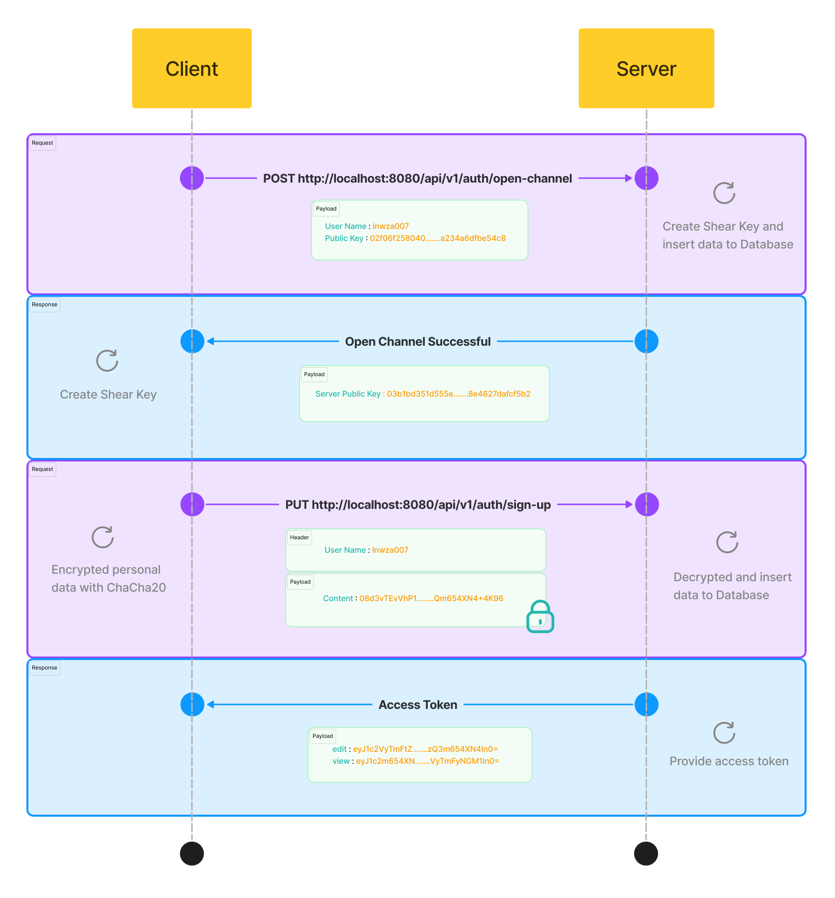
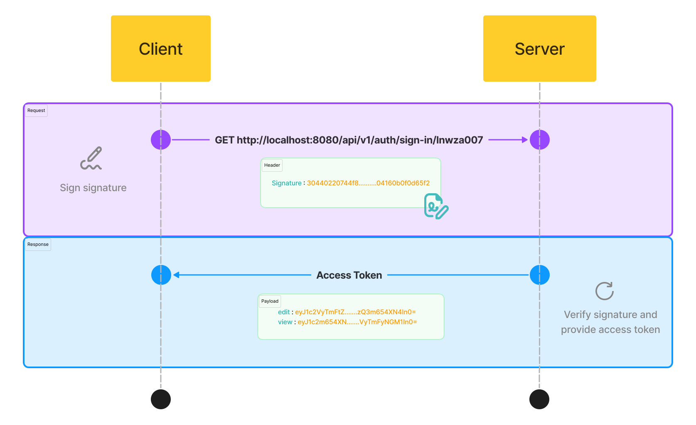

  

## Backend ผมออกแบบ โดยแบ่งออกเป็นส่วนการทำงาน 4ชั้น

#### ชั้นที่ 1 REST API
- ส่วนของการจัดส่งข้อมูล ที่จะให้บริการต่างๆแก่ Frontend

#### ชั้นที่ 2 Business Logic
- สำหรับการทำงานของ Method หรือ ส่วนการคำนวณต่างๆ 

#### ชั้นที่ 3 Connect and execute SQL
- ในส่วนนี้จะเป็นการเชื่อมกับฐานข้อมูลและดำเนินการ SQL และ จัดเตรียมรูปแบบข้อมูล ที่จะส่งให้ ขั้นที่ 2 ไปคำนวณต่อ

#### ชั้นที่ 4 Database
- ฐานข้อมูลนี้คือก้อนของข้อมูล ที่มีการเก็บข้อมูลต่างๆไว้ และในส่วนนนี้ยังมีการ เขียนโปรแกรมทำอะไรบ้างอย่างกับข้อมูล เพื่อให้ฐานข้อมูลฉลาดขึ้น จะได้ลดภาระ หรือลดโค้ดในชั้นที่ 2 และ 3

## Tech Stack

### Backend

	<table>
		<tr>
			<td></td>
			<td></td>
			<td></td>
			<td></td>
			<td></td>
			<td></td>
			<td></td>
			<td></td>
		</tr>
	</table>

### Frontend

	<table>
		<tr>
			<td></td>
			<td></td>
			<td></td>
			<td></td>
			<td></td>
			<td></td>
			<td></td>
			<td></td>
		</tr>
	</table>

 

## Sequence Diagram

ระบบลงทะเบียนและเข้าสู่ระบบ

### Account Register 

เพื่อความปลอดภัยของข้อมูลที่ส่งไปยังเซิร์ฟเวอร์ การลงทะเบียนจำเป็นต้องมีการสร้างช่องทางสื่อสารที่ปลอดภัย โดยเฉพาะเมื่อข้อมูลที่ส่งมีความลับ เช่น ข้อมูลส่วนตัว หรือข้อความแชท ดังนั้น การใช้ Cryptography เป็นสิ่งสำคัญอย่างยิ่ง

#### Elliptic Curve
ใช้ [Elliptic Curve](https://cryptobook.nakov.com/asymmetric-key-ciphers/elliptic-curve-cryptography-ecc) และเส้นโค้ง [Secp256k1](https://www.secg.org/sec2-v2.pdf) ในการสร้าง **Public Key** เป็นรูปแบบบีบอัดขนาด 33 Bytes 

> _Private Key นั้นสร้างโดยนำ Password มา Hash ด้วย Sha256 ทั้งหมด 7,200 รอบ เพื่อถ่วงเวลาพวกที่จะมา brute force_

#### ECDH Share Key
ต่อไปใช้ [ECDH Key Exchange](https://cryptobook.nakov.com/asymmetric-key-ciphers/ecdh-key-exchange) เพื่อสร้าง Private Key ใหม่ โดยในกระบวนการนี้ Client และ Server จะแลกเปลี่ยน Public Key เพื่อสร้างกุญแจที่ใช้ในการเข้ารหัสข้อมูล

#### ChaCha20
สุดท้ายใช้ [ChaCha20](https://cryptobook.nakov.com/symmetric-key-ciphers/chacha20-poly1305) เพื่อเข้ารหัสข้อมูล โดยใช้ Private Key ที่ได้จากขั้นตอน ECDH

  

### Log in

การเข้าสู่ระบบเพื่อเข้าใช้งานนั้น Client ต้องสร้างลายเซ็นดิจิตอล และส่งไปให้ Server เมื่อทาง Server ตรวจสอบเลยเซ็นแล้วพบว่าถูกต้อง จากนั้นจะส่ง Access token กลับไปให้ Client

##### วิธีการทำงาน

#### ECDSA
นำข้อความที่กำหนดมา Hash ด้วย Sha256 เพียงครั้งเดียว แล้วนำ Private Key มาใช้สร้างลายเซ็นแบบ ECDSA แล้วส่งไปให้ Server เพื่อรับ Access token

> ลายเซ็นที่สร้างขึ้นใช้งานได้ครั่งเดียวเท่านั้น ไม่สามารถใช้ซ้ำได้

  

